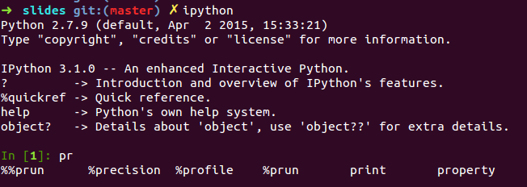
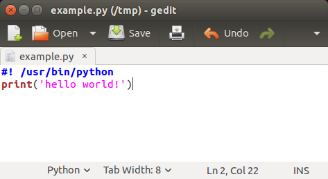

Introduction
============

### Python basics - lecture \#1

[Noam
Elfanbaum](http://thespoon.ghost.io)/[@noamelf](http://twitter.com/noamelf)

-   Name and your first experience with a computer
-   Class schdule

### About

-   Guido Van-Rossum side project in the late 1980's
-   Called after the Monty Python (comedy) group
-   Community-driven
-   Can be found on almost every platform and every field
-   Easy to extend using C and package system
-   2 main versions: Python2 and Python3
-   Beautiful

#### Java

    public class Hello{
      public static void main(String[] args){
        System.out.println("Hello, world!");
      }
    }
                    

#### C++

    #include <iostream>

    int main(){
      std::cout << "Hello World!" << std::endl;
      return 0;
    }
                

#### Python

    print('Hello World!')
                    

### Philosophy

-   The Zen of Python:
    -   Beautiful is better than ugly
    -   Explicit is better than implicit
    -   Simple is better than complex
    -   Complex is better than complicated
    -   Readability Counts
-   Other ideas
    -   There should be one obvious way to do it
    -   Clarity over speed
    -   We’re all consenting adults here

Python qualities
----------------

-   Compromise between shell script and C++/Java program
-   Intuitive syntax
-   Interpreted
-   Dynamically typed
-   High-level data types
-   Slower than lower level languages

Interpreted?
------------

-   What does it mean for a language to be “interpreted?”
-   Trick question – “interpreted” and “compiled” refer to
    implementations, not languages
-   The most common Python implementation (CPython) is a mix of both:
    -   Compiles source code to byte code (.pyc files)
    -   Then interprets the byte code directly, executing as it goes
    -   No need to compile to machine language
    -   Essentially, source code can be run directly

### The REPL

-   Read Evaluate Print Loop
-   Quick!
-   Helps test Python behaviour
-   Bad for multiline code (i.e. classes, functions)

### Running Python - IPython



-   Auto-completion
-   Magic functions
-   IPython notebook

``` {.fragment}
noam@ubuntu:~$ sudo pip install ipython[all]
noam@ubuntu:~$ ipython
                
```

### Running Python - .py files

-   Python source files
-   (No compiliation)

``` {.fragment}
noam@ubuntu:~$ gedit /tmp/example.py
                
```



``` {.fragment}
noam@ubuntu:~$ python /tmp/example.py
hello world!
                
```

### Play with the interpeter

    >>> 1 + 1
    2
    >>> print('hello world')
    hello world
    >>> x = 1
    >>> y = 2
    >>> x + y
    3
    >>> print(x)
    1
                    

### Style overview

-   PEP 8 - “code is read much more often than it is written”
-   Blocks are denoted by whitespace
-   Use spaces, not tabs (or set the editor to insert spaces instead of
    tabs)
-   Single line comments are denoted with \#
-   Multi-line comments are denoted with '''
-   Variable and function names should be lower case with underscores
    separating words
-   Use docstrings to document what a function does:

### Datatypes overview

None

Booleans (True, False)

Integers, Floats

Sequences

-   Lists
-   Tuples
-   Strings
-   Dictionaries

Classes and class instances

Modules and packages

### Booleans

Booleans: `True, False`

The following act like `False`:

-   `None`
-   `0`
-   `[]`(Empty sequences)

Everything else acts like `True`

### Boolean operations

These are the Boolean operations, ordered by ascending priority:

  -------------------------------------------------------------------------
  Operation
  Result
  ------------------------------------ ------------------------------------
  `x or y`                             `x and y`
  if *x* is false, then *y*, else *x*  if *x* is false, then *x*, else *y*
  -------------------------------------------------------------------------

\*and, or are short-circuit operators

### Boolean examples

``` {.fragment}
>>> not True
False
                
```

``` {.fragment}
>>> True or False
True
                
```

``` {.fragment}
>>> False and True
False
                
```

``` {.fragment}
>>> (1 + 1) or True
2
                
```

``` {.fragment}
>>> True and (2 + 2)
4
                
```

``` {.fragment}
>>> not 0
True
                
```

Go to socrative quiz!

### Integers and floats

Numeric operators: `+ - * / // % **`

No i++ or ++i, but we do have += and -=

Int and Float:

### Assignments

``` {.fragment}
>>> a = b = 0
>>> a, b = 3, 5                    
                
```

Super cool:

``` {.fragment}
>>> a, b = b, a
>>> a
5
>>> b
3                                       
                
```

### Comparisons

``` {.fragment}
>>> 5 == 5
True
            
```

``` {.fragment}
>>> 'hello' == 'hello'
True                
            
```

``` {.fragment}
>>> 1 != 2
True                
            
```

``` {.fragment}
>>> 5 > 3
True                
            
```

``` {.fragment}
>>> 'b' > 'a'
True                
            
```

### If Statements

``` {.fragment}
if a == 0:
    print 'a is 0'
elif a == 1:
    print 'a is 1'
else:
    print 'a is something else'
            
```

### For Loops

``` {.fragment}
>>> range(5)
[0, 1, 2, 3, 4]
            
```

``` {.fragment}
for i in range(5):
    print(i, end=' ')

0 1 2 3 4
            
```

### Break and Continue

``` {.fragment}
for i in range(10):
    if i == 3:
        continue
    elif i==8:
        break
    print(i, end=' ')
    
0 1 2 4 5 6 7              
            
```

### While Loops

``` {.fragment}
          
i = 0
while i <= 3:
    print(i, end=' ')
    i += 1

0 1 2 3
        
```

### Ranges

range(n) produces [0, 1, ..., n-1]

range(i, j) produces [i, i+1, ..., j-1]

range(i, j, k) produces [i, i+k, ..., m]

``` {.fragment}
>>> range(5, 25, 3)
[5, 8, 11, 14, 17, 20, 23]
                
```

### Functions

    >>> def increment(x):
            return x + 1                    
    >>> increment(3) 
    4
                    

-   Colon (:) indicates start of a block
-   Following lines are indented
-   Function declaration doesn’t specify return type
-   all functions return a value (None if not specified)
-   Parameter datatypes are not specified either

### Dynamic typing

What does “dynamically typed” mean?

-   Variable types are not declared
-   Python figures the types out at runtime

### Dynamic typing

We can check types with our code:

``` {.fragment}
>>> type(x)
<type 'int'>
                
```

``` {.fragment}
>>> isinstance(x, int)
True
                
```

-   `isinstance` caters to inheritance and is more suitable for type
    check in production code
-   `type` is more suitable for fiddling and debugging

### Dynamic typing

Interpreter keeps track of all types and doesn’t allow you to do that
are incompatible with that type:

    >>> increment('3')
    TypeError: cannot concatenate 'str' and 'int' objects
                    

### Duck typing

> “When I see a bird that walks like a duck and swims like a duck and
> quacks like a duck, I call that bird a duck.”James Whitcomb Riley

### Duck typing

``` {.fragment}
>>> def increment(x):
        try: 
            return x + 1
        except TypeError:
            return int(x) + 1
                
```

``` {.fragment}
>>> increment('3')
4
                
```

-   Duck typing is concerned with establishing the **suitability of an
    object for some purpose** rather than what type it is.
-   Very pythonic

Reference:
----------

-   [Lili Dworkin](http://www.cis.upenn.edu/~cis192/spring2014/)

