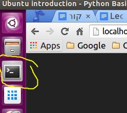
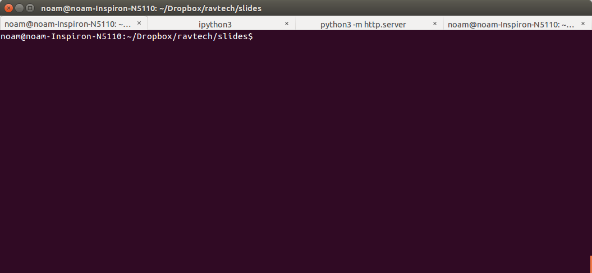
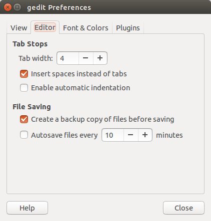

Ubuntu/Linux
=====================
### Python basics course

[Noam Elfanbaum](http://thespoon.ghost.io)/[@noamelf](http://twitter.com/noamelf)

---


### General
- FOSS (Free and Open Source Software) operating system <!-- .element: class="fragment" -->
- 20 million users worldwide (only Ubuntu) <!-- .element: class="fragment" -->
- Founded in 2004 by Canonical. <!-- .element: class="fragment" -->
- Ubuntu is a South African word meaning: <!-- .element: class="fragment" -->
> "I am what I am because of who we all are" <!-- .element: class="fragment" -->

---
### FOSS
- FREE to use <!-- .element: class="fragment" -->
- FREE to share <!-- .element: class="fragment" -->
- FREE to develop <!-- .element: class="fragment" -->

---
### Ubuntu? Linux?
- Ubuntu is the distribution, Linux is the kernel <!-- .element: class="fragment" -->
- There are many other distributions: Fedora, Redhat, Arch etc... <!-- .element: class="fragment" -->
- Each distro has it's pros and cons. Ubuntu is emphasizes user friendliness and as such it's very popular <!-- .element: class="fragment" -->

---
### Command Line Interface (CLI)
- Advantages: <!-- .element: class="fragment" -->
  - automation <!-- .element: class="fragment" -->
  - reproducibility <!-- .element: class="fragment" -->
  - communicability  <!-- .element: class="fragment" -->
- Disadvantages: <!-- .element: class="fragment" -->
  - steep learning curve <!-- .element: class="fragment" -->
  - a lot of typing (but the more tricks you know the more this can be an advantage!) <!-- .element: class="fragment" -->

---
### Ubuntu terminal
 <!-- .element: class="fragment" -->
 <!-- .element: class="fragment" -->

---
### The filesystem
- Folders are usually referred to as directories <!-- .element: class="fragment" -->
- Locations in the filesystem, are called paths: <!-- .element: class="fragment" --> 
`/home/noam/Dropbox` <!-- .element: class="fragment" -->
- The directory and file names that make up a path are always separated by a forward-slashes <!-- .element: class="fragment" -->
- Paths can be absolute or relative <!-- .element: class="fragment" -->
- There's shorthand for commonly used directories: <!-- .element: class="fragment" -->
  - . is the current working directory <!-- .element: class="fragment" -->
  - .. is the parent directory (i.e. one directory up) <!-- .element: class="fragment" -->
  - ~ is your home directory <!-- .element: class="fragment" -->
  - / is the absolute path <!-- .element: class="fragment" -->

---
### cd  
- Change the current working directory with `cd` (Change Directory):
```bash
$ cd Downloads
``` 
- Return to home directory:
```bash
# use ~ symbol
$ cd ~
# or go up a dir
$ cd ..
```
---
### pwd
- See where you are with `pwd` (Print Working Directory):
```bash
$ pwd
/home/noam/
```

---
### mkdir
- Create new directory with `mkdir` (make directory):
```bash
$ mkdir tmp
$ cd tmp
$ pwd
/home/noam/tmp
```

---
### ls
- list the contents of a directory the command `ls` (list):
```bash
$ cd ~
$ ls
Calibre Library  Downloads          examples.desktop  photorec.ses       
Desktop          Dropbox            fontconfig        Pictures            
Documents        edx_sandbox.retry  Music             proj          
```

---
### touch
- Create empty file with `touch`:
```bash
$ cd tmp
$ touch example.txt
$ ls
example.txt
```

---
### cp
- Copy files with the command `cp` (copy)
- Syntax is `cp SOURCE DEST`
```bash
# make a copy of example.txt
$ cp example.txt example1.txt
$ ls
example1.txt  example.txt
# copy ~/tmp/example.txt to another dir
$ cd ..
$ mkdir tmp1
$ cd tmp1
$ cp ../tmp/example.txt .
$ pwd
/home/noam/tmp1
$ ls
example.txt
```

---
### mv
move files with the command `mv` (move):
```bash
$ mv ../tmp/example1.txt .
$ ls ../tmp
example.txt
$ ls
example1.txt  example.txt
```

The same command is used to rename files, too:
```bash
$ mv example1.txt example2.txt
$ ls 
example2.txt  example.txt
```

---
### rm, rmdir
remove files and directories with `rm` (remove) and `rmdir` (remove directory):
```bash
$ cd ~
$ rm tmp
rm: cannot remove ‘tmp’: Is a directory
$ rmdir ~/tmp
rmdir: failed to remove ‘tmp’: Directory not empty
$ rm tmp/example.txt
$ rmdir ~/tmp
# or you can remove the whole dir recursevly with -r (dangerous!)
$ rm -r tmp1
```

---
### Setup workspace and edit file
We will use gedit since it's easy to work with:
```bash
$ mkdir workspace
$ cd workspace
$ gedit example.py
```

---
### Setup gedit properties
- In the menu, go to Edit->Preferences
- Choose the editor tab.
- Change tabs width to 4.
- Select 'insert spaces instead of tabs'


---
### Reference
- [Ubuntu beginners guide](http://www.gegeek.com/documents/cheat_sheets/Ubuntu%20Beginners%20Guide.pdf)
- [Shell intro](http://vic.gedris.org/Manual-ShellIntro/1.2/ShellIntro.pdf)
- [Introduction to UNIX and the Command Line Interface](https://software.rc.fas.harvard.edu/training/intro_unix/latest/)